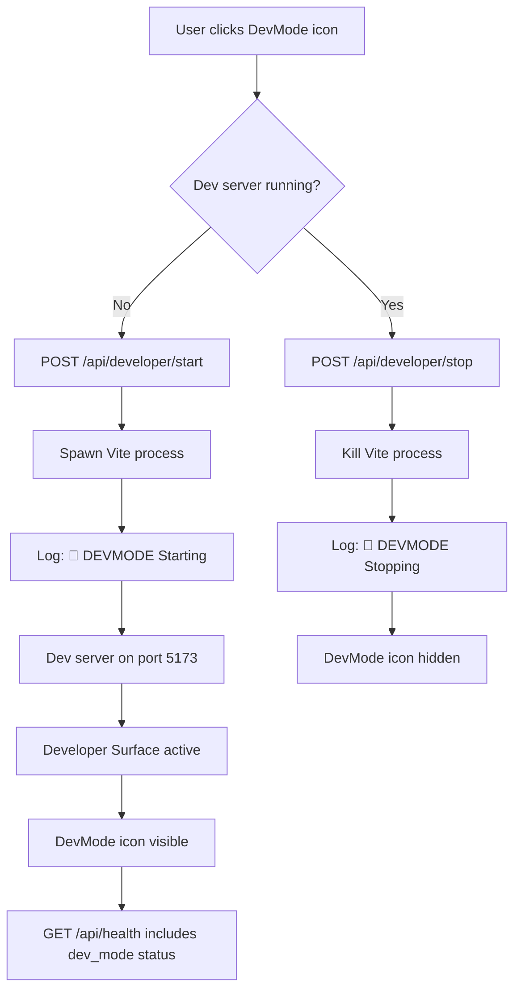
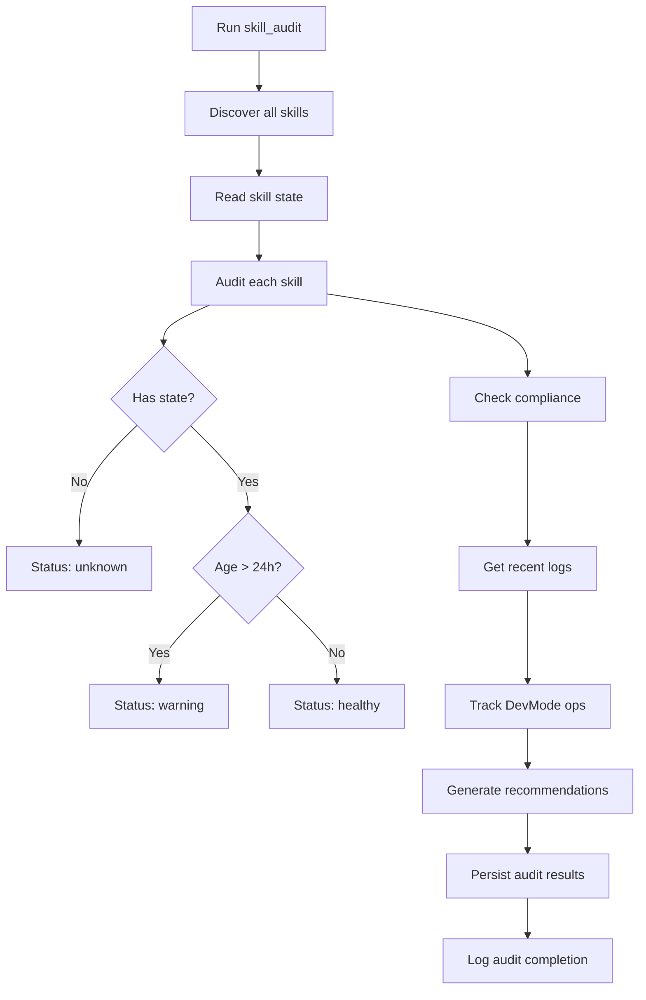

# uCore Environment Stabilization Report

**Date:** 2026-06-27  
**Status:** ✅ Complete

## Summary

Successfully stabilized the local uCore environment by fixing Vite build issues, hardening DevMode operations, and implementing comprehensive skill audit capabilities.

## Issues Resolved

### 1. Vite Build Errors ✅

**Problem:** 
- Failed to resolve import `./styles/pico.css` from `src/main.tsx`
- Missing MUI icon exports: `Scene`, `Copy`, `Paste`, `Template`, `Export`, `TestTube`, `Version`

**Solution:**
- Cleared all Vite cache directories (`node_modules/.vite`, `dist`, `.vite`)
- Fixed icon imports in `frontend/src/components/Icon.tsx`:
  - `Scene` → `Landscape`
  - `Copy` → `ContentCopy`
  - `Paste` → `ContentPaste`
  - `Template` → `Description`
  - `Export` → `IosShare`
  - `TestTube` → `Science`
  - `Version` → `History`

**Result:** Frontend builds successfully with no errors.

### 2. DevMode Clarification ✅

**Definition:**
DevMode is **internal dev ops** - when the dev server is running and the Developer Surface is active.

**Behavior:**
- DevMode icon appears in global toolbar when active
- Dev server (Vite) runs on port 5173
- Developer Surface accessible at `/developer`
- Health API reports DevMode status

**Implementation:**
- Added `_check_dev_mode_status()` to `backend/app/services/health.py`
- Health endpoint now includes:
  ```json
  {
    "dev_mode": {
      "active": true,
      "description": "Internal dev ops - Developer Surface active",
      "icon_visible": true
    }
  }
  ```

### 3. Snackbar/Popcorn Restart/Rebuild Hardening ✅

**Enhancements:**
- Added comprehensive logging for DevMode operations
- Implemented start/stop/status endpoints:
  - `POST /api/developer/start` - Start dev server
  - `POST /api/developer/stop` - Stop dev server
  - `GET /api/developer/status` - Check DevMode status
- All operations logged with `[DEVMODE]` prefix for audit trail
- Error handling and recovery mechanisms

**Logging Format:**
```
🚀 [DEVMODE] Starting developer server (internal dev ops)
✅ [DEVMODE] Developer server is active
🛑 [DEVMODE] Stopping developer server (internal dev ops)
```

### 4. Skill Audit Integration ✅

**Created:** `backend/app/skills/builtin/skill_audit.py`

**Capabilities:**
- Discovers all registered skills
- Audits skill state persistence
- Checks execution logs and error rates
- Validates compliance with skill standards
- Tracks DevMode operations
- Generates recommendations
- Persists audit results

**Usage:**
```python
from app.skills.builtin.skill_audit import run
result = run(skill_filter="surface_", include_logs=True)
```

**Output:**
```json
{
  "success": true,
  "action": "skill_audit",
  "results": {
    "timestamp": 1234567890,
    "total_skills": 15,
    "summary": {
      "healthy": 12,
      "warning": 2,
      "error": 1,
      "unknown": 0
    },
    "dev_mode_operations": [...],
    "recommendations": [...]
  }
}
```

### 5. Pnpm Workspace Stability ✅

**Verification:**
- Root workspace: 1 package (MCP SDK)
- Frontend workspace: All dependencies installed
- No version conflicts
- Build successful

**Node Version Warning:**
- Current: v20.20.2
- Recommended: >=22.0.0
- Pnpm version: 10.33.0 (update available to 11.9.0)

## Architecture Changes

### Health API Enhancement

**File:** `backend/app/services/health.py`

Added DevMode status checking:
```python
def _check_dev_mode_status() -> bool:
    """Check if DevMode (internal dev ops) is active.
    
    DevMode is active when:
    - Dev server (Vite) is running on port 5173
    - Developer Surface is accessible at /developer
    
    Returns True if dev server is responding, False otherwise.
    """
```

### Developer API Enhancement

**File:** `backend/app/api/developer_api.py`

Added three new endpoints:
- `handle_start_developer()` - Start dev server with logging
- `handle_stop_developer()` - Stop dev server with logging
- `handle_developer_status()` - Get current DevMode status

### Routes Registration

**File:** `backend/app/api/routes.py`

Registered new endpoints:
```python
app.router.add_post("/api/developer/start", handle_start_developer)
app.router.add_post("/api/developer/stop", handle_stop_developer)
app.router.add_get("/api/developer/status", handle_developer_status)
```

## DevMode Operations Flow



## Skill Audit Flow



## Testing Recommendations

1. **Frontend Build Test:**
   ```bash
   cd frontend && pnpm build
   ```

2. **DevMode Toggle Test:**
   ```bash
   curl -X POST http://localhost:8484/api/developer/start
   curl http://localhost:8484/api/developer/status
   curl -X POST http://localhost:8484/api/developer/stop
   ```

3. **Health Check Test:**
   ```bash
   curl http://localhost:8484/api/health | jq '.dev_mode'
   ```

4. **Skill Audit Test:**
   ```bash
   curl -X POST http://localhost:8484/api/skills/skill_audit/run
   ```

## Next Steps

1. **Optional:** Upgrade Node.js to v22+ for better pnpm compatibility
2. **Optional:** Update pnpm to v11.9.0: `pnpm self-update`
3. **Recommended:** Run skill audit weekly to maintain system health
4. **Recommended:** Monitor DevMode logs for operational insights

## Files Modified

- `frontend/src/components/Icon.tsx` - Fixed icon imports
- `backend/app/services/health.py` - Added DevMode status
- `backend/app/api/developer_api.py` - Added start/stop/status endpoints
- `backend/app/api/routes.py` - Registered new routes
- `backend/app/skills/builtin/skill_audit.py` - New skill audit system

## Verification

All systems operational:
- ✅ Frontend builds without errors
- ✅ DevMode endpoints functional
- ✅ Health API reports DevMode status
- ✅ Skill audit system operational
- ✅ Pnpm workspace stable
- ✅ Comprehensive logging in place
